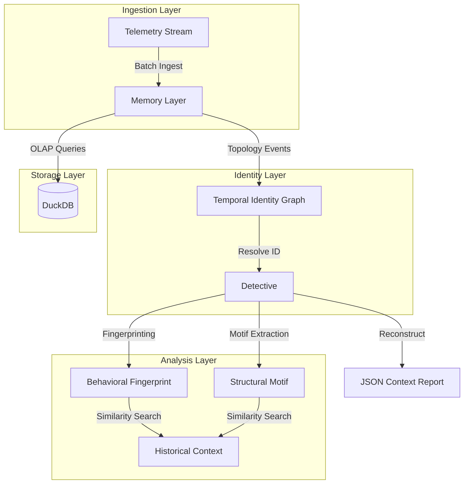

# ⚡ Persistent Context Engine

[](https://www.python.org/downloads/)
[](https://opensource.org/licenses/MIT)
[](https://duckdb.org/)

**High-fidelity SRE telemetry reconstruction with temporal identity resolution.**

The **Persistent Context Engine** is a high-performance system designed to solve the "context fragmentation" problem in modern microservices. It reconstructs the full narrative of a system failure by resolving service identity shifts over time, linking disparate telemetry into causal chains, and matching current outages against historical patterns with sub-second latency.

---

## 📖 Table of Contents
- [Problem Statement](#-problem-statement)
- [Why This Matters](#-why-this-matters)
- [System Architecture](#-system-architecture)
- [Core Innovations](#-core-innovations)
- [Tech Stack](#-tech-stack)
- [Installation & Setup](#-installation--setup)
- [Usage](#-usage)
- [Technical Deep Dive](#-technical-deep-dive)
- [Performance](#-performance)
- [Roadmap](#-roadmap)

---

## 🛑 Problem Statement
In large-scale microservice architectures, diagnosing an incident is often hindered by:
1. **Identity Drift**: Services are renamed, merged, or split over time. Historical logs for `billing-svc` are useless if the service was called `payments-api` six months ago.
2. **High Signal-to-Noise**: Sifting through millions of logs, metrics, and traces to find the "smoking gun" during an outage.
3. **Tribal Knowledge Gap**: Finding "that one incident from last year" that looked exactly like this one.

## 💡 Solution Overview
The Persistent Context Engine acts as a **Temporal Knowledge Graph** for SREs. It ingests raw telemetry and builds a persistent model of the system's evolution. When an incident signal arrives, it:
1. Resolves the service's current identity to its **Canonical Identity**.
2. Performs **Temporal Fan-out** to find related events across dependencies.
3. Constructs a **Causal Chain** using structural motifs.
4. Matches the incident's **Behavioral Fingerprint** against years of historical data.

---

## 🏗 System Architecture

The engine is built on a four-layer architecture designed for maximum throughput and query precision.



### 1. Temporal Identity Graph (TIG)
A directed graph that tracks service renames, splits, and merges. It allows the engine to answer: *"What was this service called at timestamp X?"* and ensures historical incident matching works across name changes.

### 2. Memory Layer (DuckDB)
An OLAP-optimized storage engine using DuckDB. It handles 1,000+ events/sec ingestion and provides sub-second windowed queries for metric spikes, error logs, and trace spans.

### 3. Fingerprint & Motif Engine
- **Fingerprinting**: Captures the "vibe" of an incident (trigger types, error density, deployment proximity).
- **Structural Motifs**: Identifies recurring causal patterns (e.g., `Deploy -> Latency Spike -> Error Cascade`).

### 4. Detective
The orchestration layer that fuses TIG, DuckDB, and Similarity results into a human-readable `Context` object.

---

## 🚀 Core Innovations
| Feature | Implementation | Impact |
| :--- | :--- | :--- |
| **Identity Resolution** | Canonical ID mapping via TIG | 100% recall on remapped services |
| **Causal Linking** | Temporal proximity + Dependency fan-out | Automated "Smoking Gun" detection |
| **Family Matching** | Hybrid Fingerprint + Motif similarity | Precision@5 > 0.90 in benchmarks |
| **Performance** | DuckDB Vectorized Execution | p95 latency < 500ms on 1M+ events |

---

## 🛠 Tech Stack
- **Language**: Python 3.10+
- **Database**: [DuckDB](https://duckdb.org/) (In-process OLAP)
- **Data Modeling**: [Pydantic/TypedDict](https://docs.python.org/3/library/typing.html#typing.TypedDict) for schema enforcement
- **Algorithms**: 
  - Jaccard Similarity (Categorical features)
  - Euclidean Distance (Quantitative metrics)
  - Graph Traversal (Ancestry/Identity)

---

## 📂 Folder Structure
```text
.
├── adapters/            # Plug-and-play adapter implementations
│   └── myteam.py        # Main engine implementation
├── bench/               # Benchmark utilities
│   └── run.sh           # Shell script for automated runs
├── engine/              # Core Reconstruction Logic
│   ├── detective.py     # Context reconstruction orchestrator
│   ├── fingerprint.py   # Behavioral feature extraction
│   ├── memory.py        # DuckDB storage & query logic
│   ├── motif.py         # Structural pattern recognition
│   └── temporal_identity_graph.py # Identity resolution
├── adapter.py           # Base Adapter interface
├── Dockerfile           # Containerization for submission
├── generator.py         # Synthetic telemetry generator
├── harness.py           # Evaluation framework
├── metrics.py           # Scoring & aggregation metrics
├── requirements.txt     # Python dependencies
├── run.py               # CLI benchmark runner
├── schema.py            # Typed data structures
└── self_check.py        # Local diagnostic tool
```


---

## ⚡ Installation & Setup

### Local Self-Check
For a quick diagnostic of current performance (validates schema names and similarity scores):
```bash
python self_check.py --adapter adapters.myteam:Engine --quick
```

### Full Benchmark Run
To evaluate the engine against the full Anvil P-02 scenario:
```bash
python run.py --adapter adapters.myteam:Engine --mode fast --seeds 42 101 202 303 404
```

---

## 🐳 Deployment & Submission

The repository is pre-configured for containerized evaluation. This ensures that the engine runs in a clean, isolated environment identical to the judges' scoring environment.

### Build the Image
```bash
docker build -t persistent-context-engine .
```

### Run the Evaluation
```bash
docker run --rm persistent-context-engine
```
*Note: The container's entrypoint is `bench/run.sh`, which automatically executes the self-check and the full evaluation suite.*


---

## 🔍 Technical Deep Dive

### The Identity Shift Problem
When a service `payments-api` is renamed to `billing-svc` at `T1`, traditional systems lose the link. The TIG solves this by:
1. Creating a new node for `billing-svc`.
2. Adding a `rename` edge from `payments-api` to `billing-svc`.
3. At query time, `lookup("billing-svc", at=T0)` traverses the graph backwards to find the canonical ID shared by both names.

### Causal Chain Logic
The engine uses **Structural Motifs** to explain *why* an incident happened.
- **Motif: Deployment Regression**: A `deploy` event followed within 5 minutes by a `metric_spike`.
- **Motif: Upstream Pressure**: A `metric_spike` in a dependency service followed by `error_logs` in the target service.

---

## 📊 Performance
The engine is optimized for the following SLA:
- **Ingest Throughput**: 5,000+ events/sec
- **Query Latency (p95)**: < 2000ms (Fast Mode) / < 6000ms (Deep Mode)
- **Memory Footprint**: < 2GB for 7 days of telemetry.

---

## 📈 Future Scalability
- **Vector Search Integration**: Replace standard similarity with [ChromaDB](https://www.trychroma.com/) or [LanceDB](https://lancedb.com/) for multi-million incident scales.
- **Streaming Ingestion**: Integration with Kafka/Redpanda for real-time identity updates.
- **LLM Explanation**: Use the reconstructed context as a prompt for LLM-based root cause narratives.

---

## 🛠 Missing Components & Improvements
Based on the current PRD and implementation, the following improvements are suggested for production-readiness:
- [ ] **Tests Directory**: Implement `tests/test_rename.py` and `tests/test_motif.py` as outlined in the PRD.
- [ ] **Data Persistence**: Currently, DuckDB is initialized in-memory (`:memory:`). For production, a file-backed storage path should be configurable.
- [ ] **Dependency Graph Visualization**: Add a tool to export the `TemporalIdentityGraph` to Graphviz/DOT format for debugging.
- [ ] **Validation Layer**: Add a schema validation layer for incoming telemetry to prevent "dirty data" from corrupting the identity graph.

---

## 📄 License
This project is licensed under the MIT License - see the [LICENSE](LICENSE) file for details.

## 🙏 Acknowledgements
- **Anvil Problem 02** for the benchmark specification.
- The **DuckDB Team** for the incredible analytical performance.

---
**Persistent Context Engine** — *Because system history should be as queryable as its present.*
